# Lab_8_MobileSecurity
# Analyse de sécurité d’une application mobile Android

## 1. Présentation
L'objectif de ce projet est d'évaluer la posture de sécurité d'une application Android (APK) en exploitant des solutions spécialisées telles que BeVigil et Yaazhini. Cette démarche vise à identifier les potentielles failles de conception, les erreurs de configuration et les fuites de données avant tout déploiement en production.

## 2. Environnement
* OS: Windows
* Outils: BeVigil, Yaazhini, PowerShell

## 3. Préparation
Avant d'entamer les vérifications, une archive APK nous a été fournie. Son empreinte cryptographique a été générée au préalable afin d'assurer l'intégrité du fichier analysé.

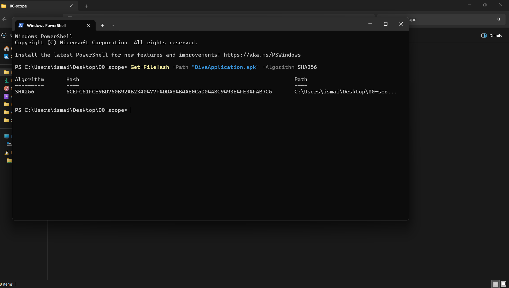

## 4. Analyse avec BeVigil
Le fichier a été soumis à la plateforme BeVigil pour un premier niveau d'inspection. Dès le téléversement finalisé, l'outil a exécuté sa routine de scan, générant ensuite un tableau de bord global qui recense le niveau de risque et les alertes majeures.

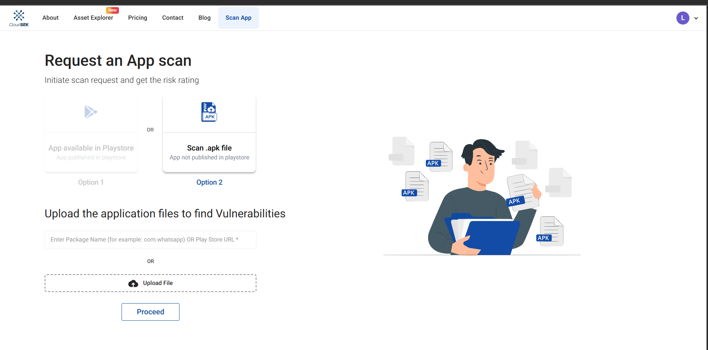
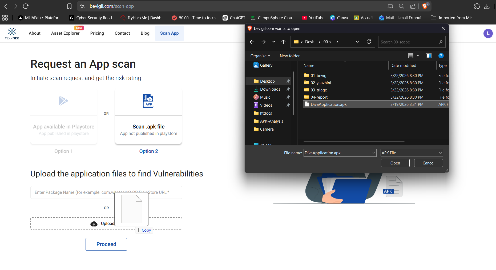
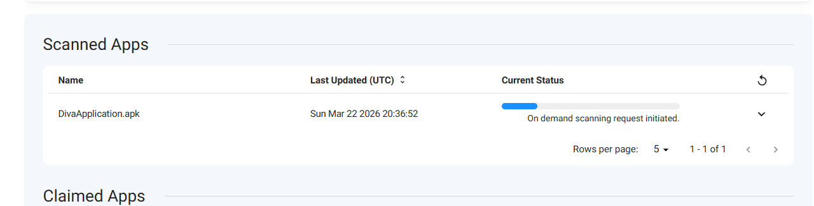
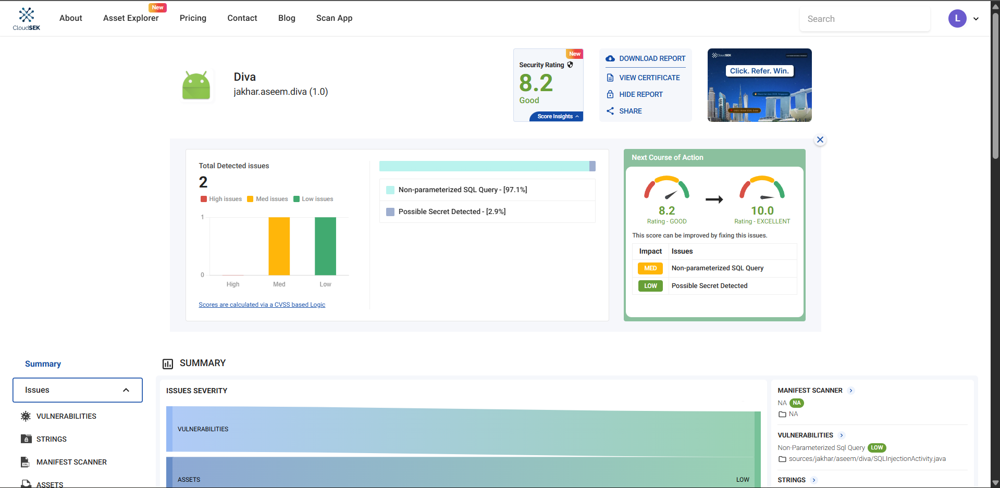

## 5. Analyse avec Yaazhini
Pour un examen approfondi du code source de l'application, l'utilitaire Yaazhini a été lancé localement. Suite au chargement de l'APK, le processus d'analyse statique s'est déclenché, révélant rapidement la présence de diverses faiblesses, notamment au niveau des permissions du manifeste et des éléments codés en dur.

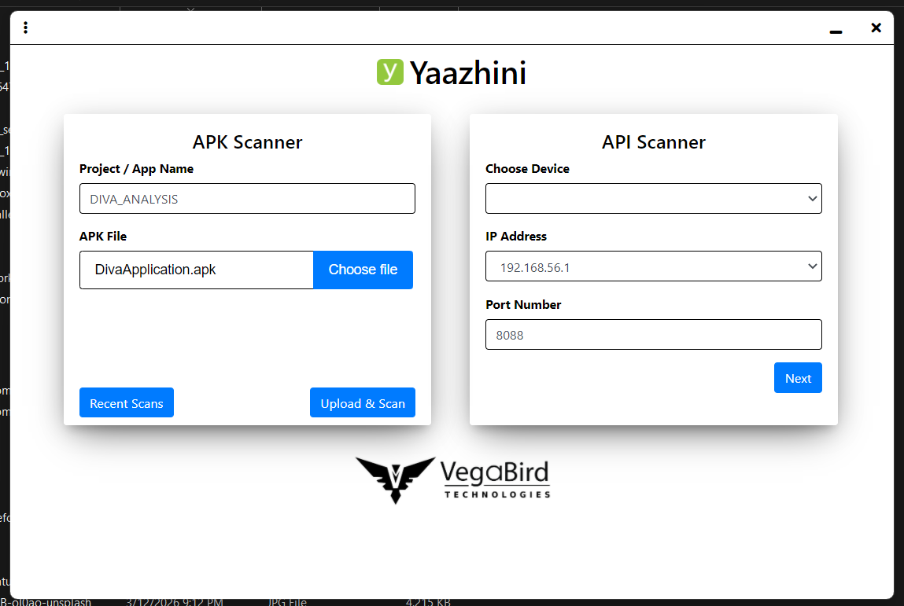
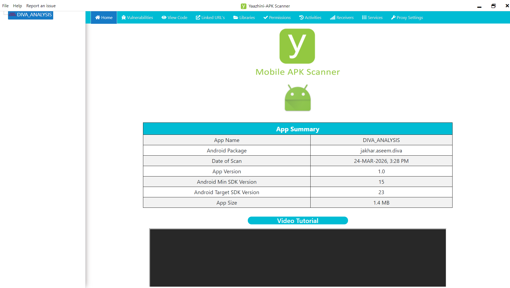
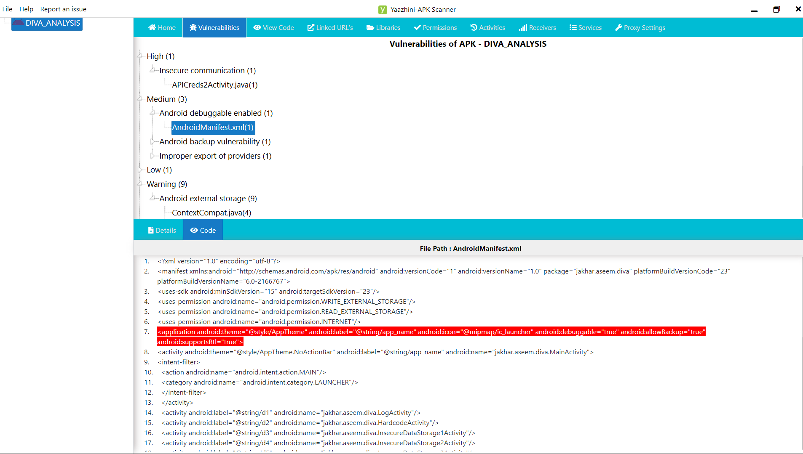

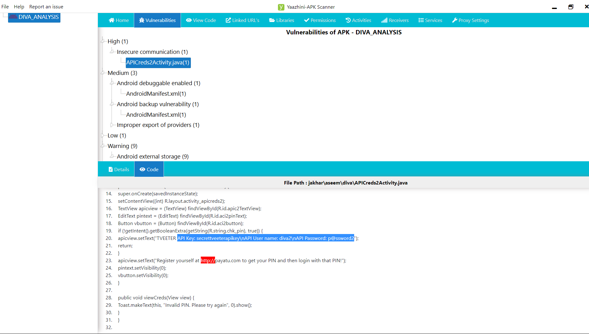

## 6. Résultats consolidés
Les éléments critiques extraits lors des différentes phases ont été normalisés puis assemblés au sein d'un document de triage centralisé.

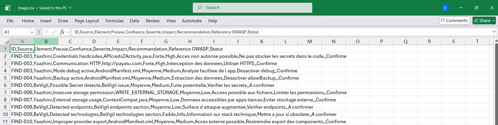

Les problèmes principaux ayant été confirmés :
* Secrets exposés dans le code
* Communication non sécurisée (HTTP)
* Mode debug actif
* Sauvegarde activée

## 7. Structure du projet
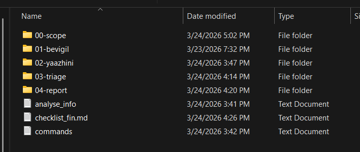

## 8. Périmètre
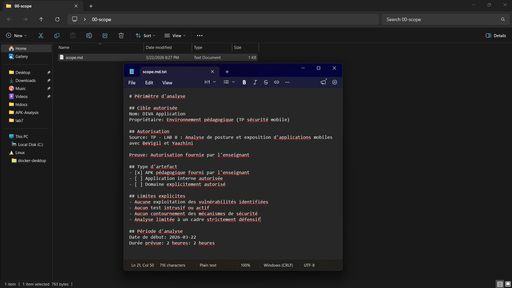

## 9. Conclusion
En résumé, de multiples faiblesses altérant significativement la confidentialité et l'intégrité de la solution ont été mises en évidence. Il devient primordial de renforcer la rigueur autour des bonnes pratiques de développement sécurisé pour pallier ces vulnérabilités.
